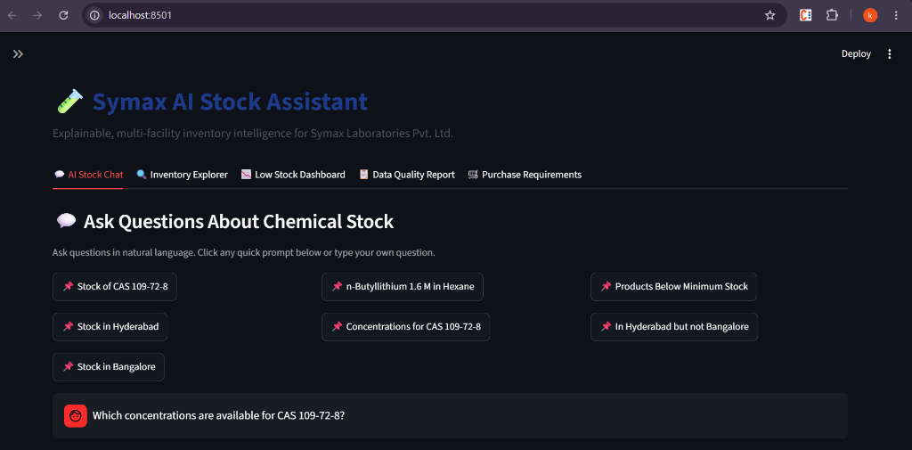
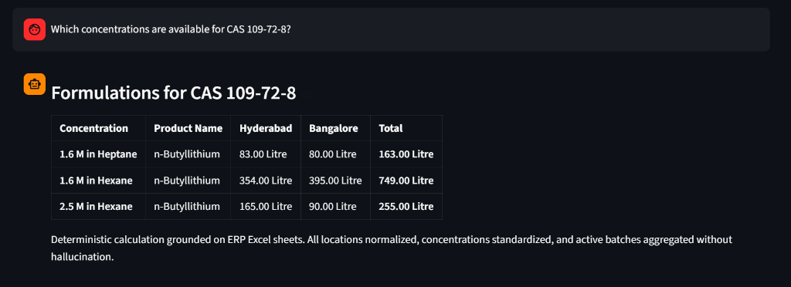
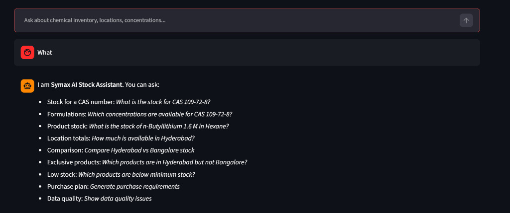

# 🧪 Symax AI Stock Assistant

> **Deterministic, explainable, and multi-facility chemical inventory intelligence for Symax Laboratories Pvt. Ltd.**

[](https://www.python.org/downloads/)
[](https://fastapi.tiangolo.com)
[](https://streamlit.io)
[-brightgreen.svg)](https://pytest.org)

---

## 📸 Application Screenshots

### 1. Interactive AI Stock Assistant Dashboard


### 2. Multi-Facility Chemical Formulation Lookup


### 3. Natural Language Query Guidance & Clarifications


---

## 📖 Executive Summary & Project Purpose

In high-stakes pharmaceutical manufacturing and chemical R&D, **inventory accuracy is mission-critical**. Chemical compounds cannot be treated like generic retail goods:
- The same chemical (e.g., **CAS 109-72-8**, *n-Butyllithium*) exists in distinct formulations (`1.6 M in Hexane`, `2.5 M in Hexane`, `1.6 M in Heptane`) that serve completely different synthetic reactions and cannot be combined or substituted arbitrarily.
- Real-world ERP spreadsheets suffer from human data entry errors: inconsistent facility naming (`HYD`, `Hyd.`, `Hyderbad`, `Bengaluru`, `Banglore`), inconsistent concentration formats (`1.6M` vs `1.6 M`), and negative adjustment entries.
- Standard generative AI chatbots hallucinate numbers, fail basic arithmetic across facilities, and produce dangerous errors.

**Symax AI Stock Assistant** solves this through a **Hybrid Architecture**:
1. **Zero Hallucination Math**: All numerical aggregations, conversions, stockout checks, deficit calculations, and location comparisons are performed **100% deterministically** using clean, vectorized Python/Pandas algorithms.
2. **LLM Natural Language Understanding**: A fast intent classifier parses complex domain questions into structured parameters (`CAS`, `Product Name`, `Concentration`, `Facility`).
3. **End-to-End Explainability**: Every calculation is grounded on ERP records with explicit audit notes, warnings for excluded records, and transparency on how values were derived.

---

## 🌟 Key Features

| Module | Description |
| :--- | :--- |
| **💬 AI Stock Chat** | Natural language queries for CAS numbers, chemical names, formulations, facility totals, exclusive products, and low stock. Includes quick-click prompt buttons. |
| **🔍 Inventory Explorer** | Filter and inspect raw and normalized chemical stock records with live filtering by CAS, Location, and Unit. |
| **📉 Low Stock Dashboard** | Real-time threshold monitoring comparing available stock against minimum safety levels with visual indicators (`LOW`, `CRITICAL STOCKOUT`). |
| **📋 Data Quality & Audit Report** | Audits 99 real-world data quality anomalies (spelling variations, negative adjustment rows, unknown records) with automated safe normalization. |
| **🛒 Purchase Requirements** | Generates procurement orders with exact replenishment quantities required to bring inventory back to safe operating levels. |

---

## 🏗️ Architecture & Component Design

```
                     ┌──────────────────────────────────────────────┐
                     │          User Interface (Streamlit)          │
                     │          http://localhost:8501               │
                     └──────────────────────┬───────────────────────┘
                                            │
                                            ▼
                     ┌──────────────────────────────────────────────┐
                     │          FastAPI Backend Service             │
                     │          http://127.0.0.1:8001               │
                     └──────────────────────┬───────────────────────┘
                                            │
                                            ▼
                     ┌──────────────────────────────────────────────┐
                     │          src.query_parser.QueryParser        │
                     │   (Regex + LLM Intent Classification)       │
                     └──────────────────────┬───────────────────────┘
                                            │
                        ┌───────────────────┴───────────────────┐
                        ▼                                       ▼
        ┌──────────────────────────────┐        ┌──────────────────────────────┐
        │  src.inventory_engine        │        │  src.low_stock_engine        │
        │  • CAS Stock Calculations    │        │  • Threshold Comparisons     │
        │  • Location Summaries        │        │  • Deficit Calculations      │
        │  • Exclusive Products        │        │  • Purchase Requisitions     │
        └───────────────┬──────────────┘        └──────────────┬───────────────┘
                        │                                      │
                        └───────────────────┬──────────────────┘
                                            │
                                            ▼
                     ┌──────────────────────────────────────────────┐
                     │          src.data_loader.DataLoader          │
                     │  • ERP Excel Ingestion                       │
                     │  • Location & Concentration Normalization    │
                     │  • Negative / Return Exclusions              │
                     └──────────────────────────────────────────────┘
```

---

## 🚀 Setup & Execution Guide

### Prerequisites
- **Python 3.10, 3.11, or 3.12**
- **Git**
- **Windows PowerShell** or **Linux/macOS Bash**

---

### Step 1: Clone the Repository

```bash
git clone https://github.com/konanki-vasundhara/Symax-AI-Stock-Assistant.git
cd Symax-AI-Stock-Assistant
```

---

### Step 2: Set Up Virtual Environment

#### On Windows (PowerShell):
```powershell
python -m venv .venv
.\.venv\Scripts\Activate.ps1
```

#### On Linux / macOS (Bash):
```bash
python3 -m venv .venv
source .venv/bin/activate
```

---

### Step 3: Install Dependencies

```bash
pip install --upgrade pip
pip install -r requirements.txt
```

---

### Step 4: Configure Environment Variables

Copy `.env.example` to `.env`:
```powershell
copy .env.example .env
```
*(Optional: Add your `GROQ_API_KEY` or `GEMINI_API_KEY` to `.env` if you wish to enable extended LLM fallbacks; deterministic regex parser works out-of-the-box without any API keys).*

---

### Step 5: Run the Applications

#### **Terminal 1: Start the FastAPI Backend**
```powershell
cd C:\Users\vasundharak\Desktop\something
.\.venv\Scripts\Activate.ps1
python -m uvicorn src.api.main:app --host 127.0.0.1 --port 8001 --reload
```
- **API Swagger Documentation:** [http://127.0.0.1:8001/docs](http://127.0.0.1:8001/docs)
- **API Health Check:** [http://127.0.0.1:8001/health](http://127.0.0.1:8001/health)

#### **Terminal 2: Start the Streamlit Frontend Dashboard**
```powershell
cd C:\Users\vasundharak\Desktop\something
.\.venv\Scripts\Activate.ps1
python -m streamlit run ui/app.py --server.port 8501
```
- **Interactive Web App:** [http://localhost:8501](http://localhost:8501)

---

## 🧪 Running Automated Unit Tests

The test suite validates data loading, normalization, 5-tier product matching, deterministic inventory math, low-stock deficit calculations, and API endpoints:

```powershell
python -m pytest tests -v
```

**Test Results:**
```
tests/test_ai_assistant.py::test_query_cas_109_72_8 PASSED               [  6%]
tests/test_ai_assistant.py::test_query_compare_locations PASSED          [ 12%]
tests/test_ai_assistant.py::test_query_low_stock PASSED                  [ 18%]
tests/test_api.py::test_health_endpoint PASSED                           [ 25%]
tests/test_api.py::test_chat_endpoint PASSED                             [ 31%]
tests/test_data_loader.py::test_data_loader_initialization PASSED        [ 37%]
tests/test_data_loader.py::test_location_normalization PASSED            [ 43%]
tests/test_data_loader.py::test_negative_stock_exclusion PASSED          [ 50%]
tests/test_inventory_engine.py::test_cas_109_72_8_quantities PASSED     [ 56%]
tests/test_inventory_engine.py::test_location_totals PASSED             [ 62%]
tests/test_inventory_engine.py::test_exclusive_products PASSED          [ 68%]
tests/test_low_stock_engine.py::test_low_stock_evaluation PASSED        [ 75%]
tests/test_product_master.py::test_exact_cas_match PASSED                [ 81%]
tests/test_product_master.py::test_synonym_resolution PASSED             [ 87%]
tests/test_product_master.py::test_fuzzy_match PASSED                    [ 93%]
tests/test_product_master.py::test_concentration_isolation PASSED       [100%]

============================= 16 passed in 6.56s ==============================
```

---

## 💬 Example Natural Language Queries to Try

| Category | Example Question |
| :--- | :--- |
| **CAS Formulations** | `Which concentrations are available for CAS 109-72-8?` |
| **Specific Product Stock** | `What is the stock of n-Butyllithium 1.6 M in Hexane?` |
| **Location Total** | `How much is available in Hyderabad?` |
| **Facility Comparison** | `Compare Hyderabad vs Bangalore stock` |
| **Exclusive Inventory** | `Which products are available in Hyderabad but not Bangalore?` |
| **Low Stock Shortages** | `Which products are below minimum stock?` |
| **Procurement Plan** | `Generate purchase requirements` |
| **Data Quality Audit** | `Show data-quality issues and explain how they are handled` |

---

## 📂 Project Structure

```
Symax-AI-Stock-Assistant/
├── data/
│   └── Symax_AI_Stock_Assessment_100plus.xlsx  # Raw ERP inventory assessment data
├── docs/
│   └── images/                                 # UI screenshots for documentation
│       ├── dashboard_overview.png
│       ├── formulations_lookup.png
│       └── interactive_chat_guidance.png
├── scripts/
│   └── analyze_dataset.py                      # Dataset inspection & audit utility
├── src/
│   ├── api/
│   │   ├── main.py                             # FastAPI application & routes
│   │   └── schemas.py                          # Pydantic request/response models
│   ├── ai_assistant.py                         # Grounding, response formatting & audit notes
│   ├── data_loader.py                          # Data ingestion, cleaning & normalization
│   ├── inventory_engine.py                     # Deterministic chemical stock calculations
│   ├── low_stock_engine.py                     # Threshold auditing & purchase requisitions
│   ├── product_master.py                       # 5-tier chemical identity matching
│   └── query_parser.py                         # Intent parsing (Regex + LLM)
├── ui/
│   └── app.py                                  # Streamlit 5-tab user interface
├── .env.example
├── .gitignore
├── README.md
└── requirements.txt
```

---

## 📄 License
Internal proprietary assessment project for Symax Laboratories Pvt. Ltd. All rights reserved.
